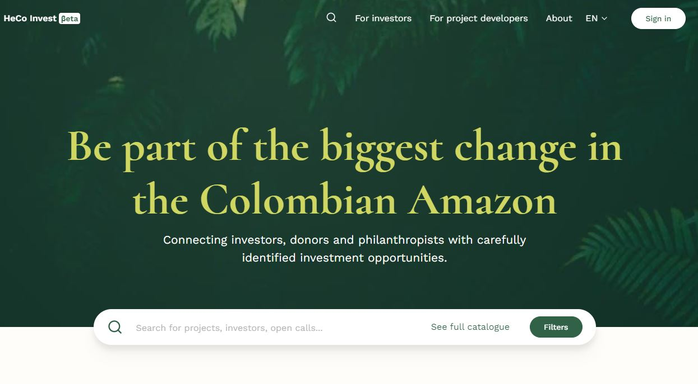

# HeCo Invest Beta 

HeCo Invest is a digital collaborative platform pilot aimed to support filling the conservation financing gap in the Amazon Basin by optimizing project financing channels in this region.

It is the result of collaboration between the IDB and IDB Lab and WWF US and Colombia. It also includes the participation of the Paulson Institute, the Basque Institute for Climate Change (BC3), Google Cloud and Vizzuality. In this pilot, the focus is put in the Colombian government initiative called Herencia Colombia (HeCo), that aims to secure 20 million hectares of sustainable landscape over the next 20 years, through investments in national conservation and sustainable development. The HeCo program does not necessarily focus exclusively on the Amazon, but of the 9 priority landscapes for biodiversity conservation and sustainable use, 4 are very closely connected to the Amazon basin and cover a total of more than 20 million hectares - 60% of the total HeCo mosaic area. And the remaining 5 landscapes are very likely to provide an indirect benefit to it too - through stocking large amounts of carbon, contributing to water regulation, or increasing the resilience to climate change of the population. 

Thus, the HeCo Invest platform pilot was envisioned as a matchmaking platform that on one hand enables investors to find projects in Colombia, with positive environmental and social impact, and on the other hand allows Colombian project developers to find adequate funding. 

The platform is tailored for these 2 main profiles: **Investors** and **Project Developers**. **Investors** - from philanthropic to venture capital - will be seeking opportunities to allocate capital - different ticket sizes - with a shared objective of conserving the Amazon or contributing to the HeCo initiative - through grants, loans or equity investment. **Project Developers** - all practitioner types from NGOs to business owners - will be seeking financial resources - different ticket sizes and project maturity levels - to support their projects or businesses.

The heart of the platform is the search results section, where the full content of the platform can be searched and filtered. there are 4 main types of search results: **Projects**, **Open calls**, **Project Developers** and **Investors**.

The HeCo iInvest platform is presented in 3 different languages in its Beta version - English, Spanish and Portuguese.

## Project sustainability impacts

At the core of the platform is the computation of each project sustainability impact. The methodology has been defined by BC3 as described [here](https://drive.google.com/drive/folders/1yEQjtbDL3LzPjsi9W4cybJ7M5d33S70_). Four sustainability impact dimensions have been identified: **Biodiversity**, **Climate**,  **Community**, and **Water**. 

The **Biodiversity** dimension will contribute to identifying areas of greatest ecosystem diversity, degree of threat or protection for flora and fauna, including landscape connectivity, and degree of endemism. 

The **Climate** dimension will be used to identify areas where interventions can be implemented to help improve climate regulation of the land sector, deforestation degradation, and carbon sequestration in both soil and biomass. 

The **Community** dimension will contribute to identifying production systems and sustainable practices where local and indigenous communities can thrive while enhancing their adaptation to climate change. 

Finally, the **Water** impact dimension will play a key role in protecting the environmental factors that help maintain the availability and regulation of the water resources, including reducing risks such as floods and droughts.

## Categories 

A project scope will need to be connected to one of these five different sectors or business activities:

- **Sustainable agrosystem** refers to sustainable and regenerative agriculture, fishing, and aquaculture as well as manufacturing of derived subproducts;
- **Tourism and recreation** refers to accommodation, travel, transportation, hospitality, visitor experiences and eco-tourism projects;
- **Forestry and agroforestry** refers to sustainable timber extraction and forest management practices, including reforestation and restoration;
- **Non-timber forest production** production of health, wellness, and cosmetic products; art, clothing, and handcrafted products; production of food and drinks;
- **Human capital and Inclusion** refers to adequate access to quality education, appropriate health services, and formal employment opportunities that respond to diverse skill profiles and are adapted to regional cultural diversity.

## Future development

The HeCo Invest platform is now in its first version. This pilot will be tested and improved throughout time to better respond to the target users needs. To know more about this project, please contact info@hecoinvest.org.

## Maintenance documentation

This repository contains all the code and documentation necessary to set up and deploy the project. It is organised in 3 main subdirectories, with accompanying documentation inside each.

| Subdirectory name | Description                                                 | Documentation                                                                                            |
|-------------------|-------------------------------------------------------------|----------------------------------------------------------------------------------------------------------|
| frontend          | The Next.js frontend application                            | [frontend/README.md](frontend/README.md)             |
| backend           | The Ruby on Rails backend application (API + backoffice)    | [backend/README.md](backend/README.md)               |
| infrastructure    | The Terraform project (deployment to Google Cloud Platform) | [infrastructure/README.md](infrastructure/README.md) |
